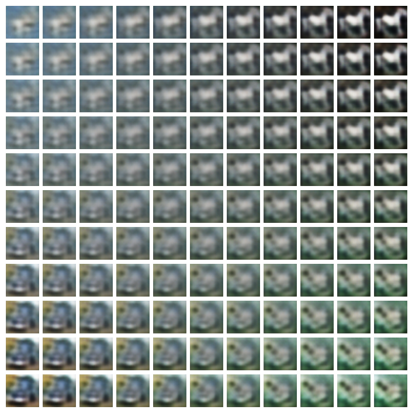

# Representation Learning on CIFAR-10

Four ways to compress a 32x32x3 image into a short vector, compared under one
question: how separable are the classes once you get there? A KNN classifier is
fitted on each representation, so a linear projection and a trained encoder are
scored on equal terms. The repository also contains a conditional DCGAN that
generates CIFAR-10 images from a class label.



Each tile is the convolutional VAE's decoder applied to a point on a plane
through latent space. The four corners are the codes of four real test images and
everything between them is bilinearly interpolated. The output moves smoothly
rather than jumping between images, which is what a well-behaved latent space
looks like. The blur is characteristic of a VAE trained with a pixel-wise
reconstruction loss.

## Requirements

Python 3.10 or later. CIFAR-10 downloads automatically through Keras on first
use.

## Installation

```bash
pip install -e .
```

With the test suite:

```bash
pip install -e ".[dev]"
```

## Usage

Train a convolutional VAE:

```python
from representation_learning import build_convolutional_vae, load_cifar10

x_train, y_train, x_test, y_test = load_cifar10()
encoder, decoder, vae = build_convolutional_vae(latent_dim=90)
vae.compile(optimizer="adam")
vae.fit(x_train, epochs=50, batch_size=128)
```

Score any representation with the shared probe:

```python
from representation_learning import knn_probe, pca_representation
from representation_learning.data import flatten

latent_train, latent_test = pca_representation(flatten(x_train), flatten(x_test), 19)
print(knn_probe(latent_train, latent_test, y_train, y_test, n_neighbors=31))
```

Build the conditional GAN:

```python
from representation_learning import build_discriminator, build_generator

generator = build_generator(latent_dim=100)
discriminator = build_discriminator()
```

## Results

Best configuration found for each method by sweeping latent size and neighbour
count. Ten classes, so chance is 10%.

| method | latent dim | k | KNN accuracy |
| --- | --- | --- | --- |
| Isomap | 23 | 51 | 27.1% |
| PCA | 19 | 31 | 41.5% |
| Variational autoencoder | 40 | 25 | 43.6% |
| Autoencoder | 80 | 25 | 44.9% |

Two things stand out. The learned encoders beat PCA, but by about three points,
and the autoencoder needs four times the latent width to find them: most of what
makes CIFAR-10 separable under KNN is already reachable with a linear projection.
And Isomap does worse than PCA despite being far more expensive, because its
neighbourhood graph is built in raw pixel space where distances between CIFAR-10
images carry little semantic signal.

The VAE trails the plain autoencoder, which is expected. The KL term pulls the
posterior toward a standard normal, and that regularisation costs some of the
class structure a KNN probe measures. What it buys is the smooth, samplable
latent space in the figure above, which the autoencoder has no guarantee of.

## Conditional DCGAN

The generator embeds the class label and concatenates it with the noise vector.
The discriminator embeds the label, broadcasts it to a full feature map, and
stacks it on the image as an extra channel. That second part is what makes the
setup conditional rather than a GAN with a label attached: the discriminator can
reject an image that looks real but shows the wrong class.

A test asserts this holds, since the same noise vector with two different labels
must produce different images.

## Project structure

```
representation_learning/
    data.py           CIFAR-10 loading and normalisation
    autoencoders.py   dense and convolutional autoencoders and VAEs
    baselines.py      PCA, Isomap, and the shared KNN probe
    cdcgan.py         conditional generator and discriminator
tests/                shape and wiring tests for every model
docs/                 figures referenced by this README
pyproject.toml        dependencies
```

## Components

| module | responsibility |
| --- | --- |
| `data` | Loads CIFAR-10, normalises pixels, flattens images for vector methods |
| `autoencoders` | Builds the four encoder architectures and the VAE training step |
| `baselines` | PCA and Isomap projections, and the KNN probe every method is scored by |
| `cdcgan` | Builds the conditional generator and discriminator |

## Testing

```bash
python -m pytest tests/
```

Ten tests. Every model is built and a small random batch pushed through it, so
the architectures and tensor shapes are checked end to end. Nothing is trained,
so the suite runs in seconds.
